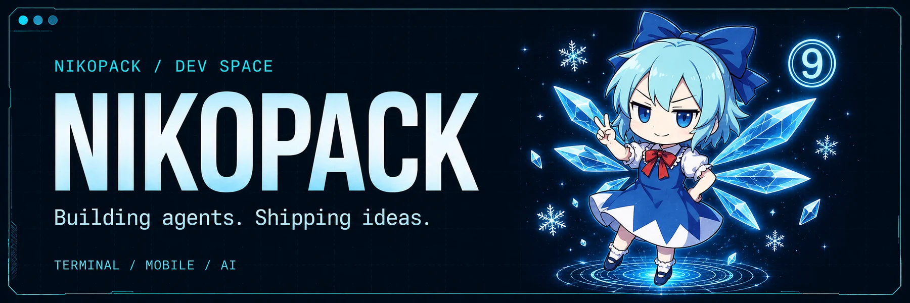

<table width="100%">
  <tr>
    <td width="69%" valign="middle">
      
    </td>
    <td width="31%" valign="middle" align="center">
      <picture>
        <source media="(prefers-color-scheme: dark)" srcset="./assets/bad-apple.gif" />
        
      </picture>
    </td>
  </tr>
</table>

  <picture>
    <source media="(prefers-color-scheme: dark)" srcset="https://readme-typing-svg.demolab.com?font=IBM+Plex+Sans&weight=600&size=22&duration=2800&pause=1600&color=7DD3FC&center=true&vCenter=true&width=320&lines=%E8%AE%A9%E6%83%B3%E6%B3%95%E6%88%90%E4%B8%BA%E7%8E%B0%E5%AE%9E" />
    
  </picture>

  <a href="https://github.com/NIKOPACK/Ti-trader">Ti</a>
  &nbsp;·&nbsp;
  <a href="https://github.com/NIKOPACK/QnQ">QnQ</a>

<strong>❄ Toolkit</strong>

  TypeScript · Python · Go · Flutter 
  React Native · Expo · Vue · Spring Boot 
  MCP · Skills · CrewAI · LangGraph · Pi

  <picture>
    <source media="(prefers-color-scheme: dark)" srcset="https://skillicons.dev/icons?i=ts,python,go,react,flutter,vue,spring,linux,docker,github&theme=dark" />
    
  </picture>

<table width="100%">
  <tr>
    <td width="50%" valign="top" align="center">
      <picture>
        <source media="(prefers-color-scheme: dark)" srcset="https://github-readme-stats-anuraghazra1.vercel.app/api?username=NIKOPACK&show_icons=true&include_all_commits=true&hide_border=true&bg_color=0B1220&title_color=7DD3FC&icon_color=38BDF8&text_color=CBD5E1&ring_color=22D3EE" />
        
      </picture>
    </td>
    <td width="50%" valign="top" align="center">
      <picture>
        <source media="(prefers-color-scheme: dark)" srcset="https://streak-stats.demolab.com?user=NIKOPACK&hide_border=true&background=0B1220&ring=22D3EE&fire=38BDF8&currStreakNum=7DD3FC&sideNums=CBD5E1&currStreakLabel=7DD3FC&sideLabels=94A3B8&dates=64748B" />
        
      </picture>
    </td>
  </tr>
</table>

  <picture>
    <source media="(prefers-color-scheme: dark)" srcset="https://raw.githubusercontent.com/NIKOPACK/NIKOPACK/output/github-contribution-grid-snake-dark.svg" />
    
  </picture>

  ⑨ &nbsp; Stay curious. Stay cool. &nbsp; ❄

