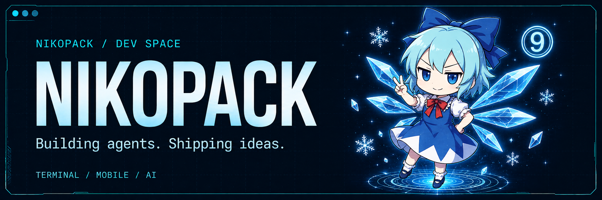

<p align="center">
  
</p>

<p align="center">
  <b>把想法做成工具，让 Agent 走进实际工作流。</b>
</p>

<p align="center">
  <a href="https://github.com/NIKOPACK/Ti-trader">Ti · Terminal Agent</a>
  &nbsp; / &nbsp;
  <a href="https://github.com/NIKOPACK/QnQ">QnQ · Mobile Agent</a>
  &nbsp; / &nbsp;
  Zhengzhou, China
</p>

<br />

### ⌘ &nbsp; Currently building

<table>
  <tr>
    <td width="50%" valign="top">
      <h3>01 &nbsp; / &nbsp; Ti</h3>
      <p><b>An agent in your terminal.</b></p>
      <p>基于 Pi 的 AI 交易命令行工具，默认从模拟交易开始。</p>
      <p><code>TypeScript</code> <code>CLI</code> <code>Pi</code></p>
      <p><a href="https://github.com/NIKOPACK/Ti-trader">Explore Ti →</a></p>
    </td>
    <td width="50%" valign="top">
      <h3>02 &nbsp; / &nbsp; QnQ</h3>
      <p><b>An agent in your pocket.</b></p>
      <p>面向 iOS 与 Android 的 AI Agent 应用，探索工具、记忆与插件。</p>
      <p><code>React Native</code> <code>Expo</code> <code>MCP</code></p>
      <p><a href="https://github.com/NIKOPACK/QnQ">Explore QnQ →</a></p>
    </td>
  </tr>
</table>

### ❄ &nbsp; My toolkit

```text
nikopack@dev ~ % cat toolkit

  build with    TypeScript · React Native · Expo
  agent tools   Claude Code · Codex · Pi
  explore       AI Agents · MCP · Skills
```

<br />

<p align="center">
  <sub>⑨ &nbsp; Stay curious. Stay cool. &nbsp; ❄</sub>
</p>
